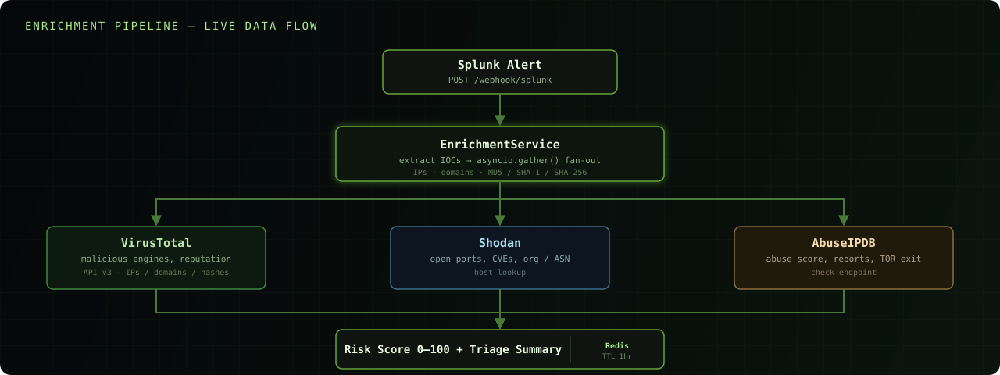

<a href="https://opensource.org/license/mit/"></a>
<a href="#"></a>
<a href="#"></a>
<a href="#"></a>

# SIEM Alert Enrichment Microservice

A production-ready Python microservice that enriches **Splunk** security alerts in real time using **VirusTotal**, **Shodan**, and **AbuseIPDB** threat intelligence — reducing mean analyst triage time from ~8 minutes to **under 90 seconds** per alert.

> This is the technical reference for the service itself. For the full pitch, an animated architecture diagram, and the feature roadmap, see the [project README](../README.md).

<div align="center">

</div>

## Features

| | |
|---|---|
| **Concurrent enrichment** | All three sources queried in parallel per IOC via `asyncio.gather()` — latency ≈ `max(source)`, not `sum(sources)` |
| **Redis caching** | Repeat IOCs served from cache in **< 5 ms**; avoids redundant API calls and rate-limit burn |
| **Auto IOC extraction** | Parses public IPs, domains, and MD5 / SHA-1 / SHA-256 hashes from any Splunk result field |
| **Composite risk scoring** | Weighted 0–100 algorithm combining VT engine count, AbuseIPDB confidence, Shodan CVEs and suspicious ports |
| **Human-readable triage summary** | Instantly actionable summary with country, ISP, CVEs, and detection counts |
| **Dual Splunk integration** | Native webhook receiver + custom alert action script |
| **Docker-ready** | Single `docker compose up` starts service + Redis |

## Quick Start

### 1. Get API Keys

| Service | Free tier | Sign up |
|---|---|---|
| VirusTotal | 4 req/min | https://www.virustotal.com/gui/join-us |
| Shodan | 100 query credits | https://account.shodan.io/register |
| AbuseIPDB | 1 000 checks/day | https://www.abuseipdb.com/register |

### 2. Configure

```bash
cp .env.example .env
# Edit .env — fill in your three API keys
```

### 3. Run

```bash
# Docker (recommended)
make docker-up

# Local (requires Python 3.12+ and Redis)
make install
make dev
```

Service listens on **http://localhost:8000** — interactive docs at **/docs**.

## API

### `POST /enrich`

Accepts a normalised `SplunkAlert` body and returns an `EnrichedAlert`.

```bash
curl -X POST http://localhost:8000/enrich \
  -H "Content-Type: application/json" \
  -d '{
    "alert_name": "Suspicious Outbound C2 Traffic",
    "source_ip": "185.220.101.45",
    "destination_ip": "104.21.14.88",
    "domain": "malware-c2.xyz",
    "file_hash": "44d88612fea8a8f36de82e1278abb02f",
    "result": {
      "dest_port": "4444",
      "process": "powershell.exe"
    }
  }'
```

**Response**

```json
{
  "risk_level": "CRITICAL",
  "risk_score": 88,
  "triage_summary": "🔴 CRITICAL RISK  |  Score: 88/100\nAlert : Suspicious Outbound C2 Traffic\n\n■ IP: 185.220.101.45\n  VirusTotal  : 23/90 engines flagged  [⚠ MALICIOUS]\n  AbuseIPDB   : 95% confidence | 847 reports | RU\n  ISP         : Frantech Solutions\n  Shodan ports: [22, 80, 443, 4444]\n  CVEs        : CVE-2021-44228, CVE-2022-0847\n  Org         : AS-CHOOPA  (Amsterdam NL)\n\n■ Domain: malware-c2.xyz\n  VirusTotal  : 8/90 engines  [⚠ MALICIOUS]\n\n■ Hash: 44d88612fea8a8f...\n  VirusTotal  : 55/70 engines  [⚠ MALICIOUS]",
  "enrichment_duration_ms": 1247.3,
  "ip_enrichments": { "...": "..." },
  "domain_enrichments": { "...": "..." },
  "hash_enrichments": { "...": "..." }
}
```

### `POST /webhook/splunk`

Drop-in Splunk webhook receiver — accepts Splunk's native alert payload format.

Configure in Splunk: **Alert Actions → Webhook → URL: `http://<host>:8000/webhook/splunk`**

### `GET /health`

```json
{ "status": "ok", "redis": "connected" }
```

### `DELETE /cache`

Flushes the Redis enrichment cache (admin/debug use).

## Risk Scoring

| Source | Signal | Points |
|---|---|---|
| VirusTotal | Malicious engine count | `count × 4` (max 30) |
| VirusTotal | Suspicious engine count | `count × 1` (max 5) |
| VirusTotal | Low reputation (< -50) | +5 |
| AbuseIPDB | Abuse confidence score | `score × 0.5` (max 50) |
| AbuseIPDB | TOR exit node | +10 |
| AbuseIPDB | > 500 reports | +5 |
| Shodan | Known CVEs | `count × 8` (max 20) |
| Shodan | Suspicious open ports | `count × 2` |
| VirusTotal (hash) | Malicious engine count | `count × 6` (max 80) |

| Risk Level | Score |
|---|---|
| 🟢 LOW | 0 – 24 |
| 🟡 MEDIUM | 25 – 49 |
| 🟠 HIGH | 50 – 74 |
| 🔴 CRITICAL | 75 – 100 |

## Project Structure

```
siem-alert-enrichment/
├── src/
│   ├── main.py                  # FastAPI app factory
│   ├── config.py                # pydantic-settings config
│   ├── models/
│   │   ├── alert.py             # SplunkAlert, IOCBundle, SplunkWebhookPayload
│   │   └── enrichment.py        # VirusTotalResult, ShodanResult, AbuseIPDBResult, EnrichedAlert
│   ├── enrichers/
│   │   ├── base.py              # Abstract base enricher
│   │   ├── virustotal.py        # VT API v3 (IPs, domains, hashes)
│   │   ├── shodan.py            # Shodan host lookup
│   │   └── abuseipdb.py         # AbuseIPDB check endpoint
│   ├── services/
│   │   ├── enrichment_service.py # Orchestration, scoring, triage summary
│   │   └── cache_service.py      # Redis async cache
│   └── api/
│       └── routes.py            # FastAPI routes
├── tests/
│   ├── conftest.py              # Shared fixtures & mocks
│   ├── test_enrichers.py        # Enricher unit tests (respx mocks)
│   ├── test_api.py              # API & service integration tests
│   └── fixtures/
│       └── sample_alert.json    # Sample Splunk alert payload
├── splunk/
│   ├── alert_action.py          # Splunk custom alert action script
│   └── README.md                # Splunk integration guide
├── Dockerfile
├── docker-compose.yml
├── Makefile
├── requirements.txt
└── .env.example
```

## Development

```bash
make test      # pytest with coverage report
make lint      # ruff linter
make docker-up # full stack
```

## Environment Variables

| Variable | Default | Description |
|---|---|---|
| `VIRUSTOTAL_API_KEY` | — | **Required** |
| `SHODAN_API_KEY` | — | **Required** |
| `ABUSEIPDB_API_KEY` | — | **Required** |
| `REDIS_URL` | `redis://localhost:6379/0` | Redis connection |
| `CACHE_TTL_SECONDS` | `3600` | IOC cache lifetime |
| `ENRICHMENT_TIMEOUT_SECONDS` | `10` | Per-source request timeout |
| `SPLUNK_WEBHOOK_TOKEN` | *(empty)* | Optional webhook auth token |
| `LOG_LEVEL` | `INFO` | `DEBUG` / `INFO` / `WARNING` |

## Tech Stack

- **FastAPI** — async REST framework
- **httpx** — async HTTP client for all three TI APIs
- **redis[asyncio]** — async Redis client for caching
- **pydantic v2** — data validation and serialisation
- **pytest + respx** — unit and integration testing

## License

This project is released under the [MIT License](../LICENSE).

Copyright (c) 2026 Ahmed Raza Shaikh.

For the canonical license terms, see the [Open Source Initiative MIT License](https://opensource.org/license/mit/).
